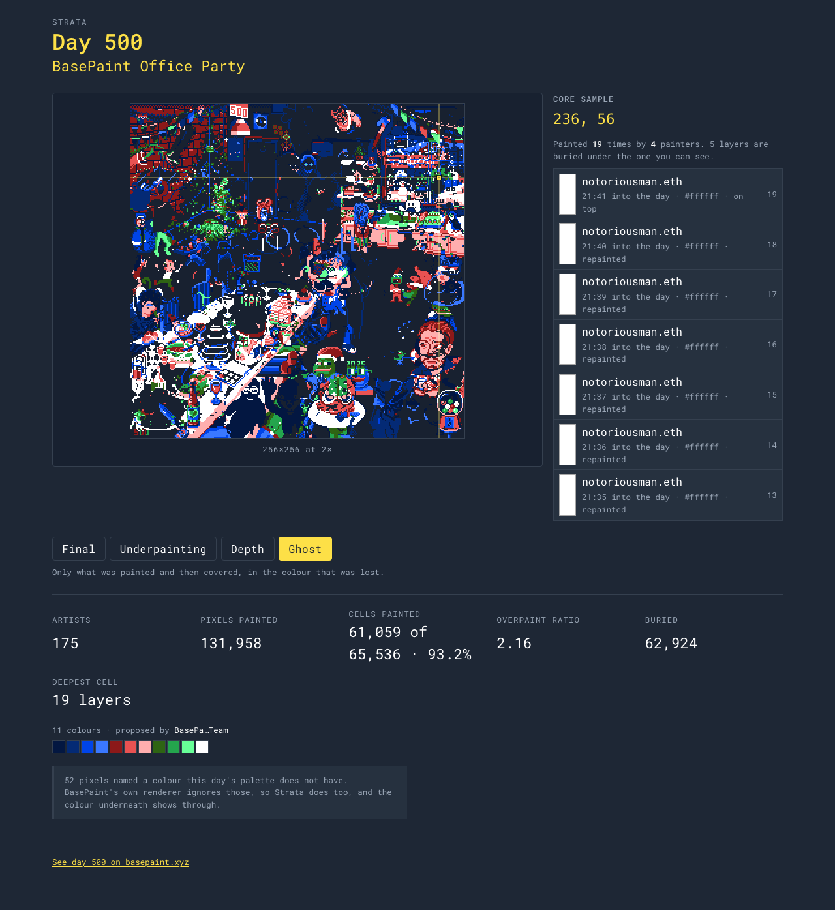

# Strata

Every BasePaint canvas is a stack of paintings, and only the top one has ever been visible. Strata digs out the rest.

A BasePaint canvas is painted by hundreds of people over 24 hours, and pixels get painted over — often many times. The published PNG is the top layer only. Every stroke that ever landed is on chain, and Strata replays all of them: what the canvas looked like at any moment, what is buried under the final image, who painted each pixel, and how much of an artist's work survived the day.



*`/day/500?mode=ghost&px=236,56`. On the left, the ghost layer: everything that survived has been dropped out, so what is left is only paint that somebody else covered over. On the right, the core sample of cell (236,56) — the deepest on the canvas, nineteen layers by four painters, read downward from the colour on the surface.*

## What it does

**Four views of the same day**, switchable without refetching anything.

- **Final** — the canvas as it ended, rebuilt stroke by stroke. It matches the official render exactly; see the table below.
- **Underpainting** — the first colour ever laid on each cell. The day as it was sketched.
- **Depth** — how many times each cell was painted, normalised to that day's deepest. A map of where the day was contested.
- **Ghost** — only the placements that were later covered, in the colour that was lost. Nobody has seen this image of a BasePaint day before.

**The core sample.** Hover, tap, or arrow-key to any cell and Strata drills it: every colour that cell has ever been, oldest at the bottom, one band per placement, with the painter's address (ENS when it resolves) and the time on each band. A 256×256 canvas has 65,536 of these.

**Artist survival.** For one address: pixels placed, cells touched, cells still holding their colour, and the survival rate between them — plus who covered them most and who they covered most. The lifetime figure states in words which days it covers, because a number with an honest scope beats one that quietly lies.

**Everything is in the URL.** Day, view mode, scrub position and selected pixel: `/day/500?mode=ghost&px=236,56&t=18400` reloads to exactly what you were looking at.

## Correctness

The one hard claim Strata makes is that its replay *is* the canvas. `npm run verify` replays a day from the on-chain strokes in Node, decodes the official render from `basepaint.net`, and diffs them cell by cell. Anything other than zero is a bug in Strata and blocks release.

Ten days, spanning both canvas sizes and the whole history, verified 2026-08-08:

| day | theme | size | placements | artists | painted cells | mismatched |
| --- | --- | --- | --- | --- | --- | --- |
| 1 | On chain summer | 144×144 | 27,498 | 101 | 17,266 | **0** |
| 100 | Nouns #915 | 144×144 | 108,114 | 596 | 20,703 | **0** |
| 250 | Cheese Factory | 144×144 | 108,647 | 496 | 20,629 | **0** |
| 365 | BasePaint Birthday Cake | 144×144 | 99,411 | 336 | 20,620 | **0** |
| 366 | On chain summer 2 | 256×256 | 113,982 | 335 | 59,730 | **0** |
| 500 | BasePaint Office Party | 256×256 | 131,958 | 175 | 61,059 | **0** |
| 750 | Ethereum in Buenos Aires | 256×256 | 152,886 | 122 | 63,925 | **0** |
| 900 | (900) Days of Onchain Summer | 256×256 | 135,013 | 75 | 63,495 | **0** |
| 1000 | BasePaint Hall of Fame | 256×256 | 146,866 | 94 | 62,477 | **0** |
| 1094 | Construction site | 256×256 | 128,610 | 69 | 63,249 | **0** |

Reproduce it with `npm run verify -- 1 100 250 365 366 500 750 900 1000 1094`. Days 365 and 366 sit either side of the canvas-size change, which is read from the theme API and never hardcoded.

What the table does not show is that reaching zero means handling the strokes that are themselves malformed, and `npm run verify` prints those separately for every day. Some pixels address coordinates off the edge of the canvas — 97 of them on day 1, 600 on day 100 — and some name a palette slot the day does not have, like the 52 on day 500. BasePaint's own renderer ignores both kinds, so Strata ignores both and counts them out loud rather than quietly dropping them.

### The day that has no answer to diff against

`basepaint.net` publishes a render only once a day has closed, so today's canvas cannot be diffed at all. `npm run live` drives it end to end instead — fetch, decode, replay, build the scrub keyframes, scrub across the elapsed window and back, drill the deepest cell, compute the leading artist's record — and checks the invariants that survive without a reference image: paint only accumulates going forward, the moment before the first stroke is blank, scrubbing to the day's end lands on the canvas the last stroke left, and a rewind followed by a second pass rebuilds it exactly.

Run on day 1095 mid-afternoon (61,663 placements, 809 of 1,440 minutes elapsed) and, as controls, on day 750 (152,886 placements) and day 1: every check passed. The worst single scrub frame across the three was 0.07 ms against a 16 ms budget, and the deepest core sample resolved in 1.09 ms.

## Running it

```bash
npm install
npm run introspect     # writes src/data/schema.json from the live GraphQL endpoint
npm run dev            # http://localhost:5173
```

`npm run introspect` is a real network call and must be run once on a clean checkout — the GraphQL field names come from the live schema, never from a guess.

There is no backend and no database. Every number on screen is derived at runtime from the BasePaint indexer and the BasePaint theme API; decoded days are cached in the browser's IndexedDB so a second visit is instant.

| command | what it does |
| --- | --- |
| `npm run dev` | Vite dev server |
| `npm run build` | typecheck, then build to `dist/` |
| `npm run test` | decoder, replay, keyframe, survival and render tests |
| `npm run typecheck` | `tsc -b` |
| `npm run lint` | oxlint |
| `npm run verify -- 500` | replay day 500 and diff it against the official PNG |
| `npm run live` | drive today's unfinished canvas end to end |
| `npm run introspect` | regenerate `src/data/schema.json` |

### Configuration

Every variable is optional; copy `.env.example` to `.env.local` to set any of them.

- `VITE_REFERRER_ADDRESS` — every BasePaint link Strata emits carries this as `?referrer=`, which earns half the protocol fee on mints it refers. Unset, the links still work, just unattributed.
- `VITE_REPO_URL` — the footer links to the source when this is set, and says nothing when it is not.
- `VITE_MAINNET_RPC` — used only to turn addresses into ENS names. Unset, Strata falls back to public endpoints; an address that will not resolve simply stays an address.

### Deploying

`vercel.json` carries the build settings and the routing. Set `VITE_REFERRER_ADDRESS` in the Vercel project settings if you want mints attributed.

## Licence and credit

The code is MIT — see [`LICENSE`](LICENSE).

**The artwork is not ours.** Every canvas Strata renders was painted by the people whose addresses it shows. All BasePaint artwork is CC0, so rendering, remixing and redistributing it is allowed without attribution — Strata credits every artist by address anyway, on every layer, because crediting them is the entire point of the tool.

Built on [BasePaint](https://basepaint.xyz/), which put the whole stroke history on chain and made this possible. Strata does not let you paint; go paint there.
